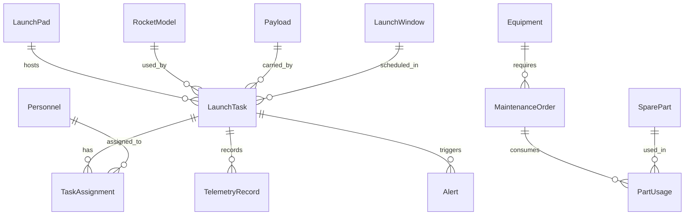

## 1. 架构设计

```mermaid
flowchart TB
    subgraph "前端层"
        "React 18 + TypeScript"
        "Tailwind CSS"
        "Zustand 状态管理"
        "React Router v6"
    end
    subgraph "数据层"
        "Mock 数据服务"
        "Zustand Store 持久化"
        "LocalStorage 缓存"
    end
    subgraph "可视化层"
        "Recharts 图表"
        "SVG 场区地图"
        "CSS 动画系统"
    end
    "React 18 + TypeScript" --> "Zustand 状态管理"
    "Zustand 状态管理" --> "Mock 数据服务"
    "Zustand 状态管理" --> "LocalStorage 缓存"
    "React 18 + TypeScript" --> "Recharts 图表"
    "React 18 + TypeScript" --> "SVG 场区地图"
    "React 18 + TypeScript" --> "CSS 动画系统"
```

## 2. 技术说明
- 前端：React@18 + TypeScript + Tailwind CSS@3 + Vite
- 初始化工具：vite-init
- 后端：无（纯前端，使用Mock数据模拟）
- 数据库：无（使用Zustand + LocalStorage持久化模拟数据存储）
- 图表库：Recharts（数据可视化）
- PDF导出：jsPDF + html2canvas
- 日期处理：date-fns
- 图标：lucide-react

## 3. 路由定义
| 路由 | 用途 |
|------|------|
| / | 总览仪表盘 |
| /base/pads | 发射工位管理 |
| /base/rockets | 火箭型号管理 |
| /base/payloads | 有效载荷管理 |
| /base/windows | 发射窗口管理 |
| /base/personnel | 人员管理 |
| /schedule | 智能排程调度 |
| /tasks | 任务推送与审批 |
| /execution | 发射执行管控 |
| /monitor | 实时监控告警 |
| /maintenance | 设备维保管理 |
| /statistics | 统计分析报表 |
| /sitemap | 可视化场区地图 |

## 4. API定义
本项目为纯前端应用，不涉及后端API。所有数据通过Mock数据服务提供，存储在Zustand Store中并持久化到LocalStorage。

### 4.1 核心数据类型

```typescript
interface LaunchPad {
  id: string;
  name: string;
  type: 'liquid' | 'solid' | 'mixed';
  status: 'idle' | 'preparing' | 'occupied' | 'maintenance';
  lastLaunchTime: string | null;
  transitionDays: number;
  coolingPeriod: number;
  equipment: string[];
  position: { x: number; y: number };
}

interface RocketModel {
  id: string;
  name: string;
  code: string;
  propellantType: string;
  leoCapacity: number;
  gtoCapacity: number;
  totalLaunches: number;
  successRate: number;
  fuelingDuration: number;
  checklistItems: string[];
}

interface Payload {
  id: string;
  name: string;
  type: 'satellite' | 'manned' | 'cargo' | 'deep_space';
  mass: number;
  organization: string;
  orbitType: string;
  specialRequirements: string;
}

interface LaunchWindow {
  id: string;
  padId: string;
  startTime: string;
  endTime: string;
  weatherScore: number;
  available: boolean;
  constraints: string[];
}

interface LaunchTask {
  id: string;
  padId: string;
  rocketId: string;
  payloadId: string;
  windowId: string;
  priority: 'critical' | 'high' | 'medium' | 'low';
  status: 'draft' | 'scheduled' | 'preparing' | 'fueling' | 'launch' | 'flight' | 'reentry' | 'completed' | 'aborted';
  scheduledTime: string;
  assignedPersonnel: TaskAssignment[];
  checklist: ChecklistItem[];
  telemetryData: TelemetryRecord[];
}

interface TaskAssignment {
  personnelId: string;
  role: 'commander' | 'fueler' | 'telemetry_op' | 'safety_officer';
  confirmed: boolean;
  adjustmentRequested: boolean;
  adjustmentReason: string;
  approved: boolean | null;
}

interface ScheduleItem {
  id: string;
  taskId: string;
  padId: string;
  startTime: string;
  endTime: string;
  transitionDays: number;
  coolingDays: number;
  conflicts: ScheduleConflict[];
}

interface MaintenanceOrder {
  id: string;
  equipmentId: string;
  type: 'routine' | 'corrective' | 'overhaul';
  reason: string;
  status: 'pending' | 'assigned' | 'in_progress' | 'completed';
  assignedTeam: string;
  partsUsed: PartUsage[];
  createdAt: string;
  completedAt: string | null;
}

interface SparePart {
  id: string;
  name: string;
  category: string;
  quantity: number;
  safetyStock: number;
  unitPrice: number;
}

interface Alert {
  id: string;
  taskId: string;
  level: 'info' | 'warning' | 'critical' | 'emergency';
  message: string;
  timestamp: string;
  acknowledged: boolean;
}

interface TelemetryRecord {
  timestamp: string;
  thrust: number;
  velocity: number;
  altitude: number;
  downrange: number;
  temperature: number;
  pressure: number;
}
```

## 5. 服务端架构图
不适用（纯前端应用）

## 6. 数据模型

### 6.1 数据模型定义



### 6.2 数据定义语言
本项目使用Zustand Store + LocalStorage持久化，无需DDL。初始Mock数据在应用启动时注入。
